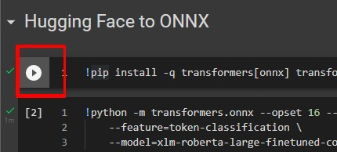
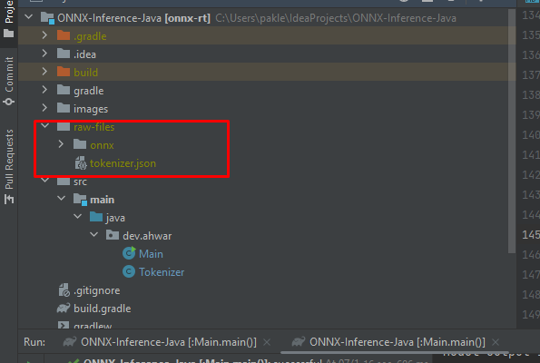
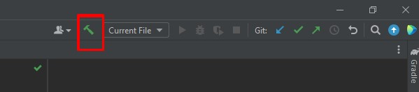
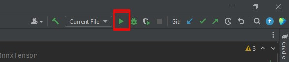

# Run HuggingFace NER (NLP) Model on Java using ONNX Runtime and DJL

A Natural Language Processing (NLP) Java application that detects `names`, `organizations`, and `locations` in a text by running Hugging Face's [Roberta NER model](https://huggingface.co/xlm-roberta-large-finetuned-conll03-english) using [ONNX Runtime](https://onnxruntime.ai/docs/get-started/with-java.html) and the [Deep Java Library](https://djl.ai/).

## Installation

Open the project folder in a Java IDE (recommended: IntelliJ IDEA Community) with Gradle support and build the project.

### Requirements

1. Java Development Kit (JDK) version 17
2. Gradle version 8.9

### Download Files

These files are required to run the project:

1. ONNX model
2. `tokenizer.json` file

### Convert the ONNX Model

To convert the Hugging Face NER model to ONNX, open this [Google Colaboratory Notebook](https://colab.research.google.com/drive/1kZx9XOnExVfPoAGHhHRUrdQnioiLloBW#revisionId=0BwKss6yztf4KS0NKaWRiQjc0RGRvQkd6ZFp3OUFhR1lTclBNPQ), run the code as shown in the image below, and follow all the steps.

(The code for this purpose is also saved in the Jupyter notebook file `convert Huggingface model to ONNX.ipynb`. You can run the code using [Jupyter Notebook](https://jupyter.org/install).)

After running one of the above codes, your ONNX model will be saved in the `onnx/` folder.

### Download tokenizer.json

The tokenizer file `tokenizer.json` was taken from this [Hugging Face repository](https://huggingface.co/xlm-roberta-large-finetuned-conll03-english). Download the `tokenizer.json` from this [link](https://huggingface.co/xlm-roberta-large-finetuned-conll03-english/raw/main/tokenizer.json).

**Move Files**

Copy the files created from the above steps into the `raw-files` directory as shown in the image below.

## Building the Project

Build the project using the button shown below.

## Run the Code

Open the `Main.java` file and click the play button as shown in the red box in the image below.

