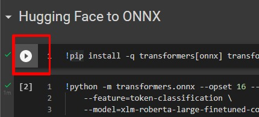
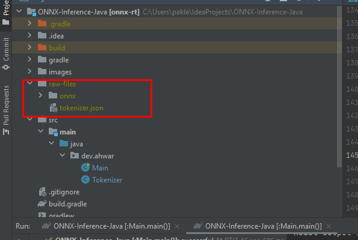
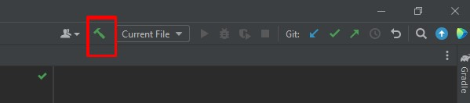
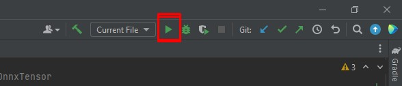

# Run HuggingFace NER (NLP) Model on Java using ONNX Runtime and DJL

A Natural Language Processing (NLP) Java application that detects `names`, `organizations`, and `locations` in a text by running Hugging Face's [Roberta NER model](https://huggingface.co/xlm-roberta-large-finetuned-conll03-english) using [ONNX Runtime](https://onnxruntime.ai/docs/get-started/with-java.html) and the [Deep Java Library](https://djl.ai/).

## Installation

Open the project folder in a Java IDE (recommended: IntelliJ IDEA Community) with Gradle support and build the project.

### Requirements

1. Java Development Kit (JDK) version 17
2. Gradle version 8.9

### Download Files

These files are required to run the project:

1. ONNX model
2. `tokenizer.json` file

### Convert the ONNX Model

To convert the Hugging Face NER model to ONNX, open this [Google Colaboratory Notebook](https://colab.research.google.com/drive/1kZx9XOnExVfPoAGHhHRUrdQnioiLloBW#revisionId=0BwKss6yztf4KeTFwdHBrOWJMQVlvdUkyby9WaEt0LzVnbkdZPQ), run the code as shown in the image below, and follow all the steps.



(The code for this purpose is also saved in the Jupyter notebook file `convert Huggingface model to ONNX.ipynb`. You can run the code using [Jupyter Notebook](https://jupyter.org/install).)

After running one of the above codes, your ONNX model will be saved in the `onnx/` folder.

### Download tokenizer.json

The tokenizer file `tokenizer.json` was taken from this [Hugging Face repository](https://huggingface.co/xlm-roberta-large-finetuned-conll03-english). Download the `tokenizer.json` from this [link](https://huggingface.co/xlm-roberta-large-finetuned-conll03-english/raw/main/tokenizer.json).

Some times, the `tokenizer.json` file is created in onnx conversion process, In that case you can find it in `onnx/` folder.

**Move Files**

Copy the files created from the above steps into the `raw-files` directory as shown in the image below.



## Building the Project

Build the project using the button shown below.



## Run the Code

Open the `Main.java` file and click the play button as shown in the red box in the image below.



## Run with Gradle

You can build and run the project using the included Gradle wrapper. The Gradle wrapper (`gradlew`) allows you to build and run the project without installing Gradle system-wide.

- **Build the application:**

```bash
./gradlew build
```

- **Run the application:**

```bash
./gradlew run
```

The `run` task will execute the `Main` class defined in the project.

## Install Gradle (optional)

If you want to install Gradle system-wide instead of using the wrapper, here are two common options. Using the Gradle wrapper is recommended for consistent builds.

- **Install via SDKMAN (recommended):**

```bash
curl -s "https://get.sdkman.io" | bash
source "$HOME/.sdkman/bin/sdkman-init.sh"
sdk install gradle
gradle -v
```

- **Install on Debian/Ubuntu (may not be latest):**

```bash
sudo apt update
sudo apt install gradle
gradle -v
```

After installing Gradle, you can run `gradle build` and `gradle run` instead of using `./gradlew`.

## Star History

<a href="https://www.star-history.com/?repos=Ahwar%2FNER-NLP-with-ONNX-Java&type=date&legend=top-left">
 <picture>
   <source media="(prefers-color-scheme: dark)" srcset="https://api.star-history.com/chart?repos=Ahwar/NER-NLP-with-ONNX-Java&type=date&theme=dark&legend=top-left" />
   <source media="(prefers-color-scheme: light)" srcset="https://api.star-history.com/chart?repos=Ahwar/NER-NLP-with-ONNX-Java&type=date&legend=top-left" />
   
 </picture>
</a>
